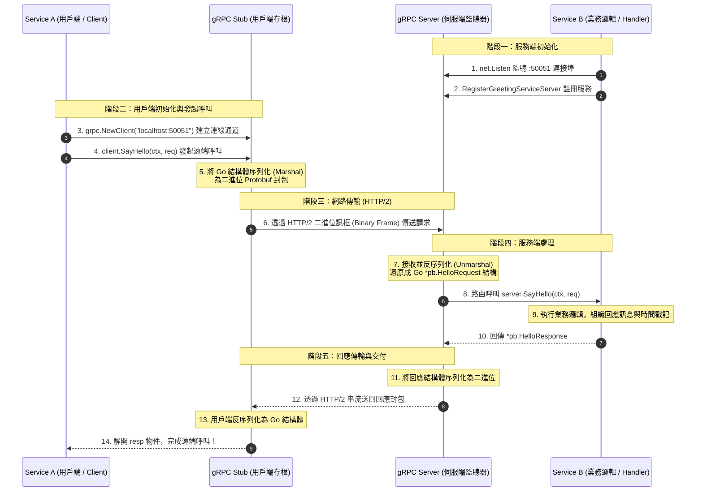
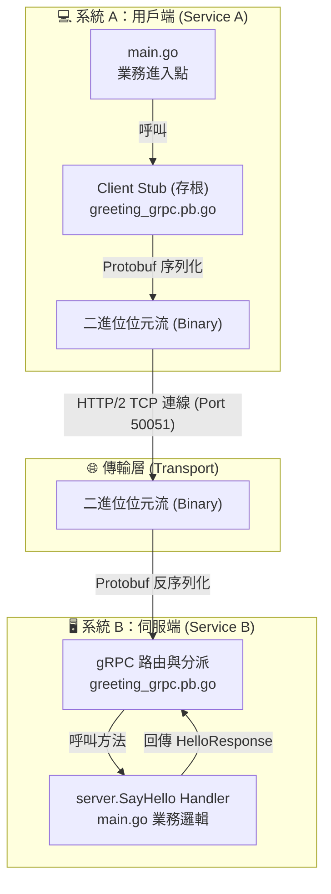
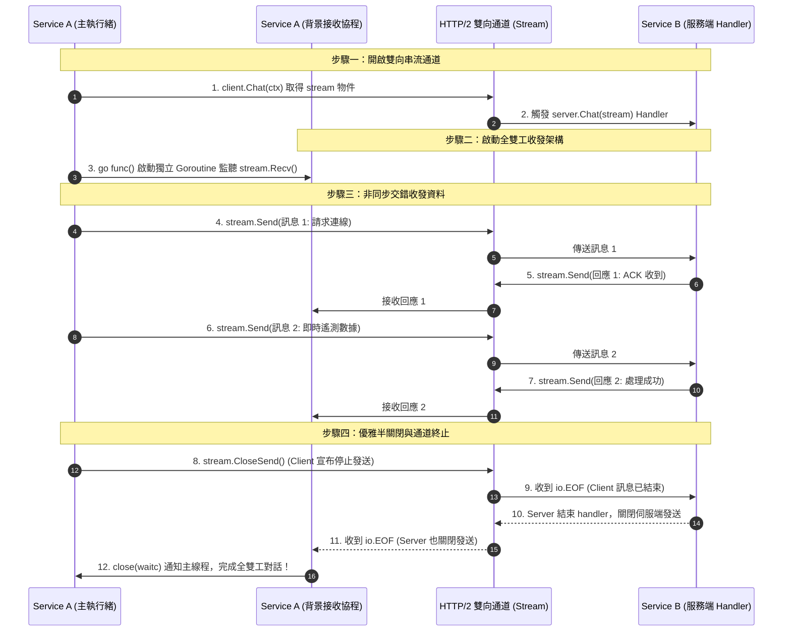
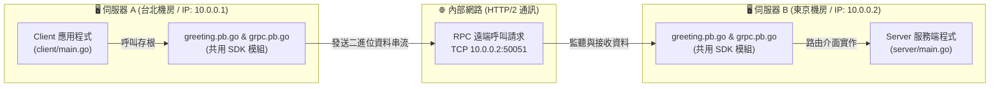

# Go 語言 gRPC 雙系統通訊完整實戰教學

本專案是一個專為初學者設計的 Go 語言 gRPC 入門教學範例。展示了兩個獨立系統（**Service A** 與 **Service B**）如何透過 **Protocol Buffers** 與 **gRPC (基於 HTTP/2)** 進行高效能、跨進程的遠端程序呼叫 (Remote Procedure Call, RPC)。

---

## 📖 目錄
1. [單向通訊流程圖 (Unary RPC)](#單向通訊流程圖-unary-rpc)
2. [雙向串流通訊與實務情境 (Bidirectional Streaming)](#雙向串流通訊與實務情境-bidirectional-streaming)
3. [專案目錄結構](#專案目錄結構)
4. [核心概念解析](#核心概念解析)
5. [新手常見疑問與實務架構 (FAQ)](#新手常見疑問與實務架構-faq)
6. [環境需求與準備](#環境需求與準備)
7. [步驟詳解：從零打造 gRPC 服務](#步驟詳解從零打造-grpc-服務)
8. [快速執行與測試](#快速執行與測試)

---

## 📊 系統通訊流程圖

### 1. 通訊循序圖 (Sequence Diagram)
展示 **Service A (Client)** 呼叫 **Service B (Server)** 的每一小步是如何發生的：



### 2. 架構層級流程圖 (Flowchart)


---

## 🔄 雙向串流通訊與實務情境 (Bidirectional Streaming)

在標準的單向 RPC (Unary RPC) 中，通訊是一問一答（Request -> Response）的阻塞模式。而在 **雙向串流 (Bidirectional Streaming RPC)** 中，Client 與 Server 可以在同一個 HTTP/2 長連線上，**完全非同步、獨立地同時收發多筆訊息**（真正的全雙工 Full-Duplex 通訊）！

### 1. 雙向串流通訊循序圖 (Sequence Diagram)



---

### 2. 💡 實際生活與商業系統中，雙向串流用在哪裡？

雙向串流是現代高併發、極致低延遲架構的殺手級武器，以下是 5 大最經典的真實落地商業情境：

#### 🌟 情境 1：即時語音 / 影像 AI 全雙工對話 (Realtime Voice & Multimodal AI)
* **典型案例**：OpenAI Realtime API、Google Gemini Live API、智慧語音助理。
* **為什麼非用雙向串流不可**：
  * 用戶對著麥克風說話時，音訊切片（Audio Chunks）被持續不斷地透過 `stream.Send()` 串流傳至伺服器。
  * 伺服器一邊進行語音識別（ASR）、一邊透過 LLM 進行語意推理，不必等整段話講完，就立即透過同一個通道將文字 Token 與合成語音 (TTS) 即時推播回用戶耳機。
  * **支援隨時插話打斷 (Interruption)**：當用戶在 AI 說話途中突然開口打斷，Client 能在同一通道立即發送中斷訊號，Server 瞬間停止前一次的語音合成並重新聆聽，達到如同真人般的自然對談！

#### 🌟 情境 2：線上即時多人協同編輯 (Real-time Collaborative Apps)
* **典型案例**：Figma、Google Docs、線上協同白板 (Miro)。
* **為什麼非用雙向串流不可**：
  * 多個使用者同時在同一張畫布上操作。每個使用者的游標座標移動、文字鍵入、物件拖曳等細微動作（CRDT 或 OT 演算法增量資料），以每秒數十次的高頻率透過 Client Stream 發給伺服器。
  * 伺服器同時接收多端的操作流，完成版本仲裁後，即時將合併後的畫布最新狀態反推回所有在線的協作者視窗。

#### 🌟 情境 3：物聯網 (IoT) 邊緣遙測與即時反向控制 (IoT Telemetry & Remote Control)
* **典型案例**：智慧車聯網 (自駕車)、無人機飛控、智慧工廠機械手臂。
* **為什麼非用雙向串流不可**：
  * 邊緣設備持續以串流向上呈報即時遙測數據（GPS 位置、發動機溫度、轉速、電池電壓）。
  * 雲端控制中心進行即時安全監控：一旦雲端演算法判定數值異常（例如車輛即將偏離或機械過熱），**無須耗費時間重新交握建立 TCP 連線**，直接在原有的雙向通道上「反向」下發緊急減速或斷電停機指令。

#### 🌟 情境 4：金融高頻行情訂閱與撮合交易 (Financial High-Frequency Trading)
* **典型案例**：加密貨幣交易所 (Binance、Coinbase)、期貨證券高頻量化撮合系統。
* **為什麼非用雙向串流不可**：
  * 量化交易機器人與撮合引擎保持單一 gRPC 雙向串流：
    * Server 端毫秒不差地將 Level 2 深度報價 (Order Book Ticks) 串流推播給客戶端。
    * 機器人一偵測到套利空間，同一微秒內在同一個串流中將限價單 (Limit Order) 灌入交易所，省去傳統 HTTP 連線重複建立的握手與協商延遲。

#### 🌟 情境 5：巨型檔案斷點分塊傳輸與即時 ACK 校驗 (Chunked File Sync)
* **典型案例**：大型雲端備份、媒體影片上傳。
* **為什麼非用雙向串流不可**：
  * Client 將 20GB 的巨型影片切分成 4MB 的小塊（Chunks）陸續上傳。
  * Server 每寫入一個 Chunk，就即時回推一個校驗雜湊值 (Hash ACK) 與伺服器寫入進度。
  * 若第 50 個區塊傳輸校驗出錯，Server 立即告知 Client 重新發送該區塊，而不用等整部 20GB 傳完才發現損壞全部重來。

---

## 📁 專案目錄結構

```text
.
├── proto/
│   ├── greeting.proto            # [契約層] 介面與訊息定義檔 (Protobuf 3)
│   └── pb/                       # [自動產物] 由 protoc 工具產生的 Go 程式碼
│       ├── greeting.pb.go        # 訊息結構體序列化/反序列化與 Getter 方法
│       └── greeting_grpc.pb.go   # Client/Server 存根介面與服務註冊函式
├── server/
│   └── main.go                   # [系統 B] gRPC 伺服端實作，提供 SayHello 服務
├── client/
│   └── main.go                   # [系統 A] gRPC 用戶端實作，發起 SayHello 呼叫
├── go.mod                        # Go 模組設定檔
├── go.sum                        # Go 依賴校驗檔
└── README.md                     # 本教學說明文檔
```

---

## 🧠 核心概念解析

### 1. 什麼是 Protocol Buffers (Protobuf)？
- Protobuf 是 Google 開發的語言無關、平台無關的**二進位序列化協定**。
- 與 JSON 相比，Protobuf 不傳遞欄位名稱字串，而是以**欄位標籤編號 (Field Number)** 來標識資料（例如 `string name = 1;` 中的 `1`），因此體積大幅縮小（通常僅為 JSON 的 20%~30%），解析速度快 5~10 倍。

### 2. 什麼是 存根 (Stub)？
- **Client Stub**：客戶端程式碼不需要手寫網路 Socket 或組裝 HTTP 封包，存根封裝了一切通訊細節，讓你可以像呼叫本地函式 `client.SayHello(ctx, req)` 一樣透明地呼叫遠端機器。
- **Server Interface**：伺服端依據 Proto 自動產生介面，開發者只需專注實作特定的介面方法即可。

### 3. 為什麼 Context 逾時控制不可或缺？
在分散式系統中，若網路斷線或 Service B 卡死，沒有設置逾時的 Client 可能會一直等待，耗盡系統線程與連線資源。透過 `context.WithTimeout(context.Background(), 5*time.Second)` 可以保證在設定秒數內未收到回應時主動釋放並報錯。

---

## 💡 新手常見疑問與實務架構 (FAQ)

### Q1：Server 端跟 Client 端是分別各自實作嗎？
> **是的，完全各自獨立實作！**

在實際微服務架構中，兩者扮演著完全不同的角色與職責：
* **Server 端 (服務提供者，如會員系統、訂單服務)**：
  * **專注於「如何提供服務與運算邏輯」**。
  * 負責實作具體的業務邏輯（如讀寫資料庫、處理交易），並在特定連接埠（如 `:50051`）啟動 TCP 監聽器等待外部請求。
* **Client 端 (服務消費者，如 API 閘道 Gateway、另一微服務)**：
  * **專注於「如何發起請求與消費結果」**。
  * 完全不需要知道 Server 內部是如何查詢資料庫或運算的，只需透過產生的客戶端存根 (Stub)，像呼叫本地函式一樣呼叫 `client.SayHello(ctx, req)`。
* **團隊分工與獨立性**：在企業實務中，Server 和 Client 通常是由**不同團隊**在**完全獨立的 Git 專案倉庫**中分別開發與部署的。

---

### Q2：`proto/pb/greeting.pb.go` 是自動產生的嗎？
> **是的！它是 100% 由 `protoc` 工具自動編譯產生的，請絕對不要手動修改它！**

* **手寫的部分**：開發者唯一需要編寫與維護的是 `proto/greeting.proto`。這份檔案就像是一份**「規格合約書」**。
* **自動產生的產物**：當我們在終端機執行 `protoc` 指令時，編譯器會自動產出兩個核心檔案：
  1. **`greeting.pb.go`**：
     * 自動產生 `HelloRequest` 與 `HelloResponse` 的 Go 結構體 (Struct)。
     * 自動產生將資料轉成二進位 (Marshal) 與還原 (Unmarshal) 的高效能序列化方法與欄位 Getter。
  2. **`greeting_grpc.pb.go`**：
     * **給 Client 使用**：自動產生「客戶端存根 (Stub)」，封裝底層的 HTTP/2 網路傳輸細節。
     * **給 Server 使用**：自動產生「介面定義 (Interface)」與服務註冊函式，規範 Server 必須實作的方法簽章。

> 💡 **維護方式**：若未來需要新增欄位（例如新增 `string email = 3;`），只需修改 `greeting.proto` 後重新執行 `protoc` 編譯指令，這兩個 `.pb.go` 檔案就會自動覆寫更新。

---

### Q3：Server, Client, `proto/pb/greeting.pb.go` 分別可以建立在不同伺服器上嗎？
> **可以！而且這正是 gRPC 與微服務最標準、最強大的運作方式！**

但這裡要建立一個關鍵認知：
> ⚠️ **`proto/pb/greeting.pb.go` 本身不是一個獨立運行的服務或實體主機，它是一段「共用程式碼函式庫 (SDK / Library)」**。

因為 Client 端需要它來**打包請求**，Server 端需要它來**解包請求並實作介面**，所以**兩邊的伺服器在編譯與執行程式時，都需要引用這份 pb 程式碼**。

#### 🌐 跨實體主機 / 容器部署架構圖


#### 🏢 實務上企業如何共享這份 `pb.go` 程式碼？
在微服務架構中，主要有以下三種常見實踐模式：

1. **獨立 Proto Git 倉庫 (最主流、最推薦)**：
   * 公司建立一個獨立的 Git Repo（例如 `github.com/company/proto-repo`）。
   * 透過 CI/CD 自動編譯 Proto 產生各語言的 SDK 並發布。
   * **Server 專案** 的 `go.mod` 引入 `github.com/company/proto-repo/pb`。
   * **Client 專案** 的 `go.mod` 亦引入 `github.com/company/proto-repo/pb`。
   * 兩邊專案各自獨立部署在不同主機或 K8s Pod 中，透過 IP / DNS 進行 gRPC 通訊。

2. **跨語言情境 (gRPC 的核心優勢)**：
   * 若 **Server 是 Go 語言**（部署於伺服器 B），而 **Client 是 Python 或 Node.js**（部署於伺服器 A）。
   * 雙方只需共享原始的 `greeting.proto` 合約檔：
     * Go Server 使用 Go 的 `protoc` 插件產生 Go 程式碼。
     * Python Client 使用 Python 的 `grpc_tools.protoc` 產生 Python 程式碼。
   * 兩端語言完全不同，依然能藉由二進位協定無縫通訊！

3. **單一倉庫架構 (Monorepo，即本範例做法)**：
   * 適合中小型專案或學習階段。Server 與 Client 放在同一個專案中，直接引用本地同一個 `proto/pb` 目錄。

---

### Q4：Server 端在雙向串流模式下，`stream.Recv()` 會阻塞等待 Client 的訊息嗎？
> **會！而且阻塞點「就在 `stream.Recv()` 這行函式的內部」！**

很多初學者在閱讀程式碼時會好奇：「程式碼裡明明沒有看到 `sleep` 或等待條件，為什麼它能卡住等訊息？」

#### 1. 為什麼表面上看不到阻塞？
因為 `stream.Recv()` 本身就是一個**同步阻塞式呼叫 (Blocking Call)**。當程式執行到 `in, err := stream.Recv()` 時：
* 只要 Client 尚未發送下一筆訊息，當前 Goroutine 就會**原地暫停等待**，絕不會跳過它往下執行。
* 只有在三種情況發生時才會解除阻塞返回：
  1. **Client 傳來新訊息**：回傳 `in != nil, err == nil`，往下執行業務邏輯與回覆。
  2. **Client 呼叫 `CloseSend()`**：回傳 `in == nil, err == io.EOF`，跳出迴圈正常關閉。
  3. **網路異常或中斷**：回傳 `err != nil`。

#### 2. 為什麼執行測試時日誌看起來一瞬間就印出來了？
因為在 Client 迴圈發送的 600ms 間隔期間，Server 端的 `Recv()` 整整**阻塞等待了 600ms**。您看到日誌印出的那一刻，正是它「收到封包解除阻塞」的瞬間！

#### 3. Go 語言底層黑科技：阻塞為何不耗 CPU？
Go 語言底層採用 **Goroutine + Netpoller (網路輪詢器)** 機制：
* 當 `Recv()` 發現目前沒有資料時，Go Runtime 會自動把該 Goroutine **掛起 (Park)**，完全釋放 CPU 資源給其他併發請求。
* 一旦網卡收到 Client 封包，Netpoller 瞬間喚醒該 Goroutine 原地甦醒繼續執行，兼具了同步程式碼的高可讀性與事件驅動的極致效能！

#### 4. 如果 Server 想「主動隨時推播」而不阻塞等待怎麼辦？
若 Server 端希望主動推播（例如定時推播行情或伺服器廣播事件），只需開闢一個**獨立背景 Goroutine** 專門負責呼叫 `stream.Send()`，原線程繼續在 `for { stream.Recv() }` 阻塞收信，達到完全解耦的全雙工運作。

---

### Q5：雙向串流中的 `Stream` 和單向接收中的 `Stub` 是不同的東西嗎？
> **是的！它們是「不同層級」的東西，而且 `Stream` 是由 `Stub` 所生產出來的！**

用最生動的生活比喻來理解：
* **`Stub` (存根 / 客戶端代理)** 就像是你的 **「智慧型手機 / 撥號總機」**。
* **`Stream` (串流管道)** 就像是 **「撥通電話後，正在通話中的這條專屬雙向語音線路」**。

#### 🔍 兩者的本質與職責對比

| 比較項目 | **Stub (客戶端存根)** | **Stream (串流管道)** |
| :--- | :--- | :--- |
| **定義** | 整個 gRPC 服務在本地的**代理人 / 總入口** | 某一次 RPC 呼叫所建立的**專屬資料傳輸通道** |
| **生命週期** | **長壽命**（通常在程式啟動時建立一次，全域重複使用） | **短壽命**（每次發起會話時建立，通訊結束即關閉銷毀） |
| **程式碼對應** | `pb.NewGreetingServiceClient(conn)` | `client.Chat(ctx)` 所回傳的 stream 物件 |
| **具備的方法** | 擁有 Proto 定義的**所有 API 方法**（如 `.SayHello()`、`.Chat()`） | 只有這條通道的**收發方法**（`.Send()`、`.Recv()`、`.CloseSend()`） |

#### 🌐 底層 HTTP/2 的運作真相
* **TCP 連線 (Connection)**：Client 與 Server 之間通常只有**一條 TCP 連線**（由 `grpc.NewClient` 建立並交由 Stub 管理）。
* **HTTP/2 訊框與串流 (Streams)**：
  * 當向 Stub 發起呼叫時，HTTP/2 會在這條 TCP 連線上建立一個邏輯通道（Stream）。
  * **單向 RPC (Unary)**：建立 Stream -> 傳送單一請求 -> 接收單一回應 -> 該 Stream 關閉銷毀（gRPC 底層自動完成，開發者無感知）。
  * **雙向串流 (Bidi Stream)**：建立 Stream -> **保持該 Stream 長期開啟** -> 雙方非同步交錯發送二進位 Data Frames -> 通訊結束後關閉。

---

## ⚙️ 環境需求與準備

1. **Go 語言** (建議 1.20 或更高版本)
   ```bash
   go version
   ```

2. **Protocol Buffer 編譯器 (`protoc`)**
   - macOS (Homebrew):
     ```bash
     brew install protobuf
     ```
   - Ubuntu/Debian:
     ```bash
     sudo apt-get install protobuf-compiler
     ```

3. **Go 專用 Protoc 外掛插件**
   ```bash
   go install google.golang.org/protobuf/cmd/protoc-gen-go@latest
   go install google.golang.org/grpc/cmd/protoc-gen-go-grpc@latest
   ```
   *請確保 `$GOPATH/bin` 或 `$HOME/go/bin` 已加入環境變數 `$PATH` 中。*

---

## 🔨 步驟詳解：從零打造 gRPC 服務

### 第一步：定義介面契約 (`proto/greeting.proto`)
定義雙方溝通的共通語言：
```protobuf
syntax = "proto3";

package greeting;
option go_package = "grpc-sample/proto/pb;pb";

service GreetingService {
  rpc SayHello (HelloRequest) returns (HelloResponse);
}

message HelloRequest {
  string name = 1;
  string message = 2;
}

message HelloResponse {
  string reply = 1;
  int64 timestamp = 2;
}
```

### 第二步：生成 Go 程式碼
在專案根目錄下執行編譯指令：
```bash
protoc --go_out=. --go_opt=module=grpc-sample \
       --go-grpc_out=. --go-grpc_opt=module=grpc-sample \
       proto/greeting.proto
```
這會在 `proto/pb/` 資料夾下產生 `greeting.pb.go` 與 `greeting_grpc.pb.go`。

### 第三步：實作 Service B (伺服端 `server/main.go`)
1. 實作 `pb.GreetingServiceServer` 介面中的 `SayHello`。
2. 啟動 `net.Listen("tcp", ":50051")`。
3. 建立 `grpc.NewServer()` 並註冊實作物件。
4. 呼叫 `grpcServer.Serve(lis)` 開始服務。

### 第四步：實作 Service A (用戶端 `client/main.go`)
1. 使用 `grpc.NewClient("localhost:50051", ...)` 建立連線。
2. 使用 `pb.NewGreetingServiceClient(conn)` 建立存根 (Stub)。
3. 設定附帶逾時的 `context.WithTimeout(...)`。
4. 呼叫 `client.SayHello(ctx, req)` 並接收回傳資訊。

---

## 🚀 快速執行與測試

請開啟兩個不同的終端機視窗（Terminal）：

### 終端機視窗 1：啟動 Service B (伺服端)
```bash
go run server/main.go
```
*預期輸出：*
```text
2026/09/17 21:29:15 🚀 [Service B] 正在啟動 gRPC 服務端...
2026/09/17 21:29:15 ✅ [Service B] gRPC 伺服器已成功啟動，正在監聽 :50051
```

### 終端機視窗 2：執行 Service A (用戶端)
```bash
go run client/main.go
```
*預期輸出（單向 + 雙向串流展示）：*
```text
2026/09/17 22:52:13 🚀 [Service A] 正在初始化 gRPC 用戶端...

--- 【展示一：單向 RPC 呼叫 (Unary RPC)】---
2026/09/17 22:52:13 📥 [Service A] 收到單向回應: 你好 Service A (用戶端)！我是 Service B，我已經收到你的訊息：「你好 Service B，這是單向 Hello 測試！」

--- 【展示二：雙向串流 RPC (Bidirectional Streaming)】---
💡 雙向串流特點：Client 與 Server 可以在同一個 HTTP/2 連線上，同時、非同步地相互收發訊息！
2026/09/17 22:52:13 📤 [Service A Stream 發送中] [Seq #1] 第一封：請求建立雙向即時資料串流管道
2026/09/17 22:52:13 📥 [Service A Stream 收到回推] 來源: [Service B (服務端)] -> 訊息: 「Service B 已收到你的第 [Seq #1] 第一封：請求建立雙向即時資料串流管道 號訊號！」
2026/09/17 22:52:14 📤 [Service A Stream 發送中] [Seq #2] 第二封：即時遙測數據回報 -> CPU負載正常、記憶體使用量 32%
2026/09/17 22:52:14 📥 [Service A Stream 收到回推] 來源: [Service B (服務端)] -> 訊息: 「Service B 已收到你的第 [Seq #2] 第二封：即時遙測數據回報 -> CPU負載正常、記憶體使用量 32% 號訊號！」
2026/09/17 22:52:14 📤 [Service A Stream 發送中] [Seq #3] 第三封：心跳偵測訊號 (Heartbeat Ping)
2026/09/17 22:52:14 📥 [Service A Stream 收到回推] 來源: [Service B (服務端)] -> 訊息: 「Service B 已收到你的第 [Seq #3] 第三封：心跳偵測訊號 (Heartbeat Ping) 號訊號！」
2026/09/17 22:52:15 📤 [Service A Stream 發送中] [Seq #4] 第四封：本日所有事件已同步完成，準備道別！
2026/09/17 22:52:15 📥 [Service A Stream 收到回推] 來源: [Service B (服務端)] -> 訊息: 「Service B 已收到你的第 [Seq #4] 第四封：本日所有事件已同步完成，準備道別！ 號訊號！」
2026/09/17 22:52:16 🚪 [Service A Stream] 本端發送完畢，呼叫 CloseSend() 半關閉連線...
2026/09/17 22:52:16 👋 [Service A Stream] 服務端已關閉串流 (收到 io.EOF)
2026/09/17 22:52:16 ✅ [Service A Stream] 雙向串流通訊順利圓滿結束！
```

同時，在**終端機視窗 1 (Service B)** 會印出接收到的即時日誌：
```text
2026/09/17 22:52:13 📥 [Service B Unary] 收到請求 -> 來源: [Service A (用戶端)], 訊息: [你好 Service B，這是單向 Hello 測試！]
2026/09/17 22:52:13 🔄 [Service B Stream] 雙向串流通道已建立，準備接收訊息...
2026/09/17 22:52:13 📥 [Service B Stream] 收到來自 [Service A (用戶端)] 的串流訊息: 「[Seq #1] 第一封：請求建立雙向即時資料串流管道」
2026/09/17 22:52:13 📤 [Service B Stream] 已即時回推回應給用戶端: [Service B 已收到你的第 [Seq #1] 第一封：請求建立雙向即時資料串流管道 號訊號！]
2026/09/17 22:52:14 📥 [Service B Stream] 收到來自 [Service A (用戶端)] 的串流訊息: 「[Seq #2] 第二封：即時遙測數據回報 -> CPU負載正常、記憶體使用量 32%」
2026/09/17 22:52:14 📤 [Service B Stream] 已即時回推回應給用戶端: [Service B 已收到你的第 [Seq #2] 第二封：即時遙測數據回報 -> CPU負載正常、記憶體使用量 32% 號訊號！]
2026/09/17 22:52:14 📥 [Service B Stream] 收到來自 [Service A (用戶端)] 的串流訊息: 「[Seq #3] 第三封：心跳偵測訊號 (Heartbeat Ping)」
2026/09/17 22:52:14 📤 [Service B Stream] 已即時回推回應給用戶端: [Service B 已收到你的第 [Seq #3] 第三封：心跳偵測訊號 (Heartbeat Ping) 號訊號！]
2026/09/17 22:52:15 📥 [Service B Stream] 收到來自 [Service A (用戶端)] 的串流訊息: 「[Seq #4] 第四封：本日所有事件已同步完成，準備道別！」
2026/09/17 22:52:15 📤 [Service B Stream] 已即時回推回應給用戶端: [Service B 已收到你的第 [Seq #4] 第四封：本日所有事件已同步完成，準備道別！ 號訊號！]
2026/09/17 22:52:16 👋 [Service B Stream] 用戶端已結束傳輸 (收到 io.EOF)，關閉本次串流連線。
```
