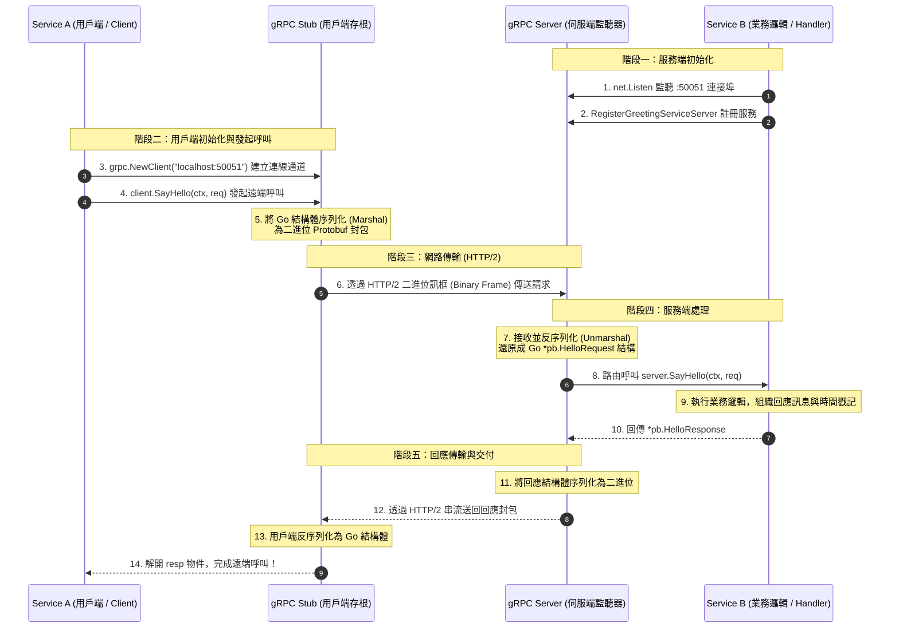
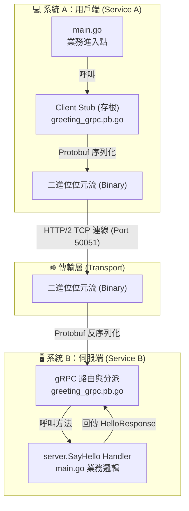
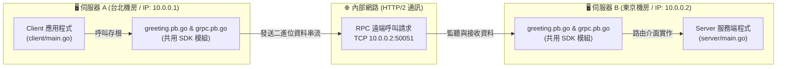

# Go 語言 gRPC 雙系統通訊完整實戰教學

本專案是一個專為初學者設計的 Go 語言 gRPC 入門教學範例。展示了兩個獨立系統（**Service A** 與 **Service B**）如何透過 **Protocol Buffers** 與 **gRPC (基於 HTTP/2)** 進行高效能、跨進程的遠端程序呼叫 (Remote Procedure Call, RPC)。

---

## 📖 目錄
1. [系統通訊流程圖 (Sequence & Flowchart)](#系統通訊流程圖)
2. [專案目錄結構](#專案目錄結構)
3. [核心概念解析](#核心概念解析)
4. [新手常見疑問與實務架構 (FAQ)](#新手常見疑問與實務架構-faq)
5. [環境需求與準備](#環境需求與準備)
6. [步驟詳解：從零打造 gRPC 服務](#步驟詳解從零打造-grpc-服務)
7. [快速執行與測試](#快速執行與測試)

---

## 📊 系統通訊流程圖

### 1. 通訊循序圖 (Sequence Diagram)
展示 **Service A (Client)** 呼叫 **Service B (Server)** 的每一小步是如何發生的：



### 2. 架構層級流程圖 (Flowchart)


---

## 📁 專案目錄結構

```text
.
├── proto/
│   ├── greeting.proto            # [契約層] 介面與訊息定義檔 (Protobuf 3)
│   └── pb/                       # [自動產物] 由 protoc 工具產生的 Go 程式碼
│       ├── greeting.pb.go        # 訊息結構體序列化/反序列化與 Getter 方法
│       └── greeting_grpc.pb.go   # Client/Server 存根介面與服務註冊函式
├── server/
│   └── main.go                   # [系統 B] gRPC 伺服端實作，提供 SayHello 服務
├── client/
│   └── main.go                   # [系統 A] gRPC 用戶端實作，發起 SayHello 呼叫
├── go.mod                        # Go 模組設定檔
├── go.sum                        # Go 依賴校驗檔
└── README.md                     # 本教學說明文檔
```

---

## 🧠 核心概念解析

### 1. 什麼是 Protocol Buffers (Protobuf)？
- Protobuf 是 Google 開發的語言無關、平台無關的**二進位序列化協定**。
- 與 JSON 相比，Protobuf 不傳遞欄位名稱字串，而是以**欄位標籤編號 (Field Number)** 來標識資料（例如 `string name = 1;` 中的 `1`），因此體積大幅縮小（通常僅為 JSON 的 20%~30%），解析速度快 5~10 倍。

### 2. 什麼是 存根 (Stub)？
- **Client Stub**：客戶端程式碼不需要手寫網路 Socket 或組裝 HTTP 封包，存根封裝了一切通訊細節，讓你可以像呼叫本地函式 `client.SayHello(ctx, req)` 一樣透明地呼叫遠端機器。
- **Server Interface**：伺服端依據 Proto 自動產生介面，開發者只需專注實作特定的介面方法即可。

### 3. 為什麼 Context 逾時控制不可或缺？
在分散式系統中，若網路斷線或 Service B 卡死，沒有設置逾時的 Client 可能會一直等待，耗盡系統線程與連線資源。透過 `context.WithTimeout(context.Background(), 5*time.Second)` 可以保證在設定秒數內未收到回應時主動釋放並報錯。

---

## 💡 新手常見疑問與實務架構 (FAQ)

### Q1：Server 端跟 Client 端是分別各自實作嗎？
> **是的，完全各自獨立實作！**

在實際微服務架構中，兩者扮演著完全不同的角色與職責：
* **Server 端 (服務提供者，如會員系統、訂單服務)**：
  * **專注於「如何提供服務與運算邏輯」**。
  * 負責實作具體的業務邏輯（如讀寫資料庫、處理交易），並在特定連接埠（如 `:50051`）啟動 TCP 監聽器等待外部請求。
* **Client 端 (服務消費者，如 API 閘道 Gateway、另一微服務)**：
  * **專注於「如何發起請求與消費結果」**。
  * 完全不需要知道 Server 內部是如何查詢資料庫或運算的，只需透過產生的客戶端存根 (Stub)，像呼叫本地函式一樣呼叫 `client.SayHello(ctx, req)`。
* **團隊分工與獨立性**：在企業實務中，Server 和 Client 通常是由**不同團隊**在**完全獨立的 Git 專案倉庫**中分別開發與部署的。

---

### Q2：`proto/pb/greeting.pb.go` 是自動產生的嗎？
> **是的！它是 100% 由 `protoc` 工具自動編譯產生的，請絕對不要手動修改它！**

* **手寫的部分**：開發者唯一需要編寫與維護的是 `proto/greeting.proto`。這份檔案就像是一份**「規格合約書」**。
* **自動產生的產物**：當我們在終端機執行 `protoc` 指令時，編譯器會自動產出兩個核心檔案：
  1. **`greeting.pb.go`**：
     * 自動產生 `HelloRequest` 與 `HelloResponse` 的 Go 結構體 (Struct)。
     * 自動產生將資料轉成二進位 (Marshal) 與還原 (Unmarshal) 的高效能序列化方法與欄位 Getter。
  2. **`greeting_grpc.pb.go`**：
     * **給 Client 使用**：自動產生「客戶端存根 (Stub)」，封裝底層的 HTTP/2 網路傳輸細節。
     * **給 Server 使用**：自動產生「介面定義 (Interface)」與服務註冊函式，規範 Server 必須實作的方法簽章。

> 💡 **維護方式**：若未來需要新增欄位（例如新增 `string email = 3;`），只需修改 `greeting.proto` 後重新執行 `protoc` 編譯指令，這兩個 `.pb.go` 檔案就會自動覆寫更新。

---

### Q3：Server, Client, `proto/pb/greeting.pb.go` 分別可以建立在不同伺服器上嗎？
> **可以！而且這正是 gRPC 與微服務最標準、最強大的運作方式！**

但這裡要建立一個關鍵認知：
> ⚠️ **`proto/pb/greeting.pb.go` 本身不是一個獨立運行的服務或實體主機，它是一段「共用程式碼函式庫 (SDK / Library)」**。

因為 Client 端需要它來**打包請求**，Server 端需要它來**解包請求並實作介面**，所以**兩邊的伺服器在編譯與執行程式時，都需要引用這份 pb 程式碼**。

#### 🌐 跨實體主機 / 容器部署架構圖


#### 🏢 實務上企業如何共享這份 `pb.go` 程式碼？
在微服務架構中，主要有以下三種常見實踐模式：

1. **獨立 Proto Git 倉庫 (最主流、最推薦)**：
   * 公司建立一個獨立的 Git Repo（例如 `github.com/company/proto-repo`）。
   * 透過 CI/CD 自動編譯 Proto 產生各語言的 SDK 並發布。
   * **Server 專案** 的 `go.mod` 引入 `github.com/company/proto-repo/pb`。
   * **Client 專案** 的 `go.mod` 亦引入 `github.com/company/proto-repo/pb`。
   * 兩邊專案各自獨立部署在不同主機或 K8s Pod 中，透過 IP / DNS 進行 gRPC 通訊。

2. **跨語言情境 (gRPC 的核心優勢)**：
   * 若 **Server 是 Go 語言**（部署於伺服器 B），而 **Client 是 Python 或 Node.js**（部署於伺服器 A）。
   * 雙方只需共享原始的 `greeting.proto` 合約檔：
     * Go Server 使用 Go 的 `protoc` 插件產生 Go 程式碼。
     * Python Client 使用 Python 的 `grpc_tools.protoc` 產生 Python 程式碼。
   * 兩端語言完全不同，依然能藉由二進位協定無縫通訊！

3. **單一倉庫架構 (Monorepo，即本範例做法)**：
   * 適合中小型專案或學習階段。Server 與 Client 放在同一個專案中，直接引用本地同一個 `proto/pb` 目錄。

---

## ⚙️ 環境需求與準備

1. **Go 語言** (建議 1.20 或更高版本)
   ```bash
   go version
   ```

2. **Protocol Buffer 編譯器 (`protoc`)**
   - macOS (Homebrew):
     ```bash
     brew install protobuf
     ```
   - Ubuntu/Debian:
     ```bash
     sudo apt-get install protobuf-compiler
     ```

3. **Go 專用 Protoc 外掛插件**
   ```bash
   go install google.golang.org/protobuf/cmd/protoc-gen-go@latest
   go install google.golang.org/grpc/cmd/protoc-gen-go-grpc@latest
   ```
   *請確保 `$GOPATH/bin` 或 `$HOME/go/bin` 已加入環境變數 `$PATH` 中。*

---

## 🔨 步驟詳解：從零打造 gRPC 服務

### 第一步：定義介面契約 (`proto/greeting.proto`)
定義雙方溝通的共通語言：
```protobuf
syntax = "proto3";

package greeting;
option go_package = "grpc-sample/proto/pb;pb";

service GreetingService {
  rpc SayHello (HelloRequest) returns (HelloResponse);
}

message HelloRequest {
  string name = 1;
  string message = 2;
}

message HelloResponse {
  string reply = 1;
  int64 timestamp = 2;
}
```

### 第二步：生成 Go 程式碼
在專案根目錄下執行編譯指令：
```bash
protoc --go_out=. --go_opt=module=grpc-sample \
       --go-grpc_out=. --go-grpc_opt=module=grpc-sample \
       proto/greeting.proto
```
這會在 `proto/pb/` 資料夾下產生 `greeting.pb.go` 與 `greeting_grpc.pb.go`。

### 第三步：實作 Service B (伺服端 `server/main.go`)
1. 實作 `pb.GreetingServiceServer` 介面中的 `SayHello`。
2. 啟動 `net.Listen("tcp", ":50051")`。
3. 建立 `grpc.NewServer()` 並註冊實作物件。
4. 呼叫 `grpcServer.Serve(lis)` 開始服務。

### 第四步：實作 Service A (用戶端 `client/main.go`)
1. 使用 `grpc.NewClient("localhost:50051", ...)` 建立連線。
2. 使用 `pb.NewGreetingServiceClient(conn)` 建立存根 (Stub)。
3. 設定附帶逾時的 `context.WithTimeout(...)`。
4. 呼叫 `client.SayHello(ctx, req)` 並接收回傳資訊。

---

## 🚀 快速執行與測試

請開啟兩個不同的終端機視窗（Terminal）：

### 終端機視窗 1：啟動 Service B (伺服端)
```bash
go run server/main.go
```
*預期輸出：*
```text
2026/09/17 21:29:15 🚀 [Service B] 正在啟動 gRPC 服務端...
2026/09/17 21:29:15 ✅ [Service B] gRPC 伺服器已成功啟動，正在監聽 :50051
```

### 終端機視窗 2：執行 Service A (用戶端)
```bash
go run client/main.go
```
*預期輸出：*
```text
2026/09/17 21:29:20 🚀 [Service A] 正在初始化 gRPC 用戶端...
2026/09/17 21:29:20 📤 [Service A] 準備發送 RPC 請求 -> 目標: localhost:50051
2026/09/17 21:29:20    發送內容: Name=[Service A (用戶端)], Message=[你好 Service B，我是 Service A，我們已透過 gRPC 成功連線！]
2026/09/17 21:29:20 📥 [Service A] 成功收到 Service B 的回應！
2026/09/17 21:29:20    回應訊息 (Reply): 你好 Service A (用戶端)！我是 Service B，我已經收到你的訊息：「你好 Service B，我是 Service A，我們已透過 gRPC 成功連線！」
2026/09/17 21:29:20    處理時間 (Timestamp): 2026-09-17 21:29:20 (Unix: 1789651760)
```

同時，在**終端機視窗 1 (Service B)** 會印出接收到的日誌：
```text
2026/09/17 21:29:20 📥 [Service B] 收到請求 -> 來源名稱: [Service A (用戶端)], 附加訊息: [你好 Service B，我是 Service A，我們已透過 gRPC 成功連線！]
2026/09/17 21:29:20 📤 [Service B] 回傳回應 -> 回應內容: [你好 Service A (用戶端)！我是 Service B，我已經收到你的訊息：「你好 Service B，我是 Service A，我們已透過 gRPC 成功連線！」]
```
